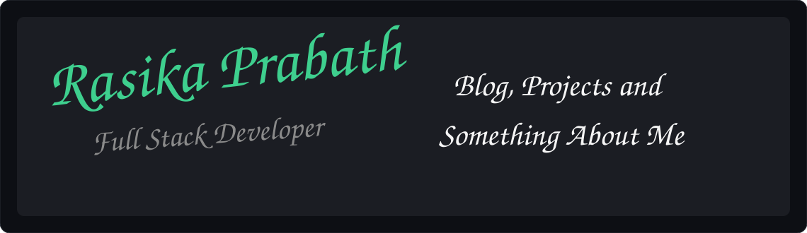

 

 

### 👋 Hi, I'm Rasika

Full Stack Developer who enjoys turning ideas into clean, working products. I build things for the web — from backend APIs to the pixels you click on.

- 🔭 Currently working on side projects and leveling up my stack
- 🌱 Always learning something new in web development
- 💬 Ask me about JavaScript, backend systems, or anything full stack
- 📫 Reach me at: **your-email@example.com**

 

### 🛠️ Tech Stack

 

### 🧰 Frontend, Backend & SE Tools (icons only)

<!-- Frontend icons -->
⚛️
⬆️
💨
📚
🎞️

  

<!-- Backend icons -->
🟢
🚂
🏠
🐘
🔷
🍃

  

<!-- Software engineering / tooling icons -->
🧪
🎭
🌲
🐳
📦
🧑‍💻
🐶

 

### 📊 GitHub Stats

 

### 🌐 Connect With Me

